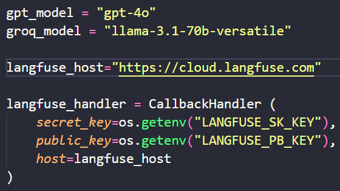

# External Integrations
## 1. Introduction

To develop this backend effectively it was a bunch of different APIs that were capable of fullfil our needs. While developing it was important to connect to different AI models (e.g. GPT-4o and LLaMA-3 70B via Groq) and to monitor everything.

## 2. APIs used

* LangFuse
* OpenAI
* Groq
(Can be updated)

## 3. Setup Guide

To use the different APIs with the current code it is mandatory to create a .env file (call it .env) on the backend folder. The needed keys are:

* GPT_API_KEY
* GROQ_API_KEY
* LANGFUSE_SK_KEY
* LANGFUSE_PB_KEY

The models are configurated on the **config** file present on the **src** folder.

## 4. Conclusion

After all this steps you might be able to use all the external integrations correctly. 